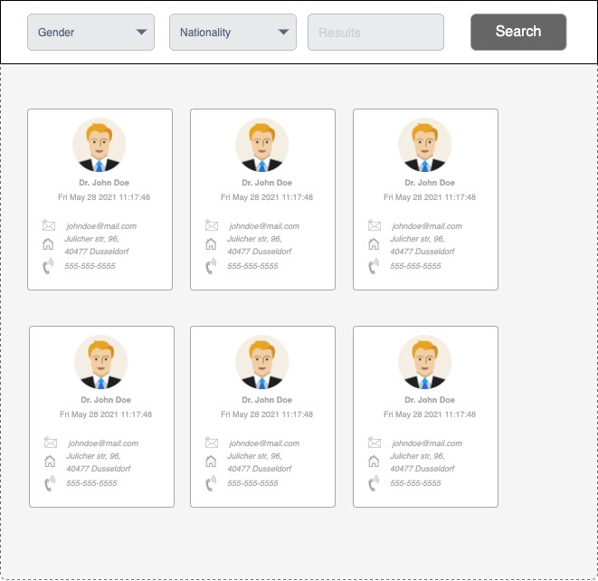

# Send request to API using `fetch()`

## Part A: Fetch and GET method

- Please impliment a small application that can show a list of random users based on some filters such as `Gender, Nationality and Number of results`.

- Filters can be created as form. Whenever the form submitted, the fetch request should be sent.

- Upon getting the response, pass the values into a profile template and make a profile for every user object that fetched from API.

- API: [`https://www.randomuser.ms/api`](https//www.randomuser.me/api) can help you to have the user data.

- Please take a look to the wireframe which is displayed below to get an idea about design of Graphical User Interface (GUI).
  
