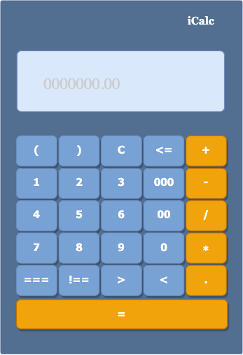

# React Introduction

- React is JS library for building fast and interactive user interfaces for the web as well as mobile apps.  
  
- To make the boiler plate of a react application, needs to install `create-react-app` package first. Then, you would have your boiler plate by using this package name together with a projectName `> create-react-app project1`

## Exercise React Application:
1. Please create the interface of an online calculator with React.
   
   - Don't forget that you can re-use the components.
   - Combine the small components in a way that the program works responsively.

2. Makes all buttons of your calculator functional by passing props into components.
3. This calculator should have following buttons:
    - Numbers `0-9`
    - Special characters `( ) .`
    - Buttons `00` and `000` to make large numbers easier. (`1` together `000` should make `1000`)
    - Basic methematical operations (+ - / x)
    - `Clear` button to remove everything from the input field.
    - `Back Space` button to remove one character from the end of mathematical expression.
    - `=` button to evaluate the expression and show the result.
    - Some buttons for logical operators( `< > =< >= === !==`)

4. In addition to above buttons,needs to add an `input` field for entering the expression.  
 
   

---
#### Note: 
You can get idea from the following picture:  

