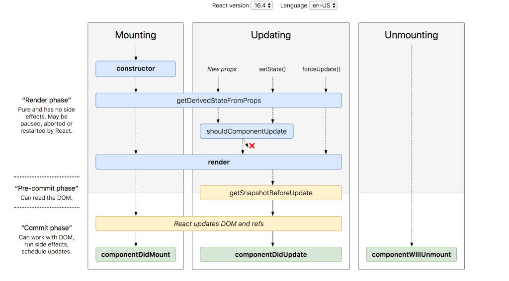

### `As always if you want to work on your personal project, please join a breakout room and  let me know whenever needs my help.`

&nbsp;
# Today topics:
- ### Small Recap on
1. SPA > REACT > Life Cycle Methods
2. SPA > REACT > Routing

- ### Answring questions
  

&nbsp;
# 1. React Life Cycle methods

- Each component in React has a lifecycle of `birth`, `growth`, `death`.
- Technically The three phases are: `Mounting`, `Updating`, and `Unmounting`. 

&nbsp;

<caption>Life cycle methods for React Class Components</caption>

&nbsp;
### Mounting Phase:
- `constructor()` : Is the first method in the cycle and sets the initial values to the state.
- `render()` : Is the most used lifecycle method which is a pure function that can not set the state.
- `componentDidMount()` : Executed as soon as your component mounted. Set the state is possible. Good place to load the get and load data.

&nbsp;
### Updating Phase:
- `render()` : After every update the JSX should be re-rendered to update the DOM.
- `componentDidUpdate()` : Will invoke as soon as any changes in prop or state objects happen.

&nbsp;
### Unmounting Phase:
- `componentWillUnmount()` : This method calls before a component be closed (unmounted) from the DOM. It's a good place for garbage collection.

&nbsp;
### Rarely used methods:
- `shouldComponentUpdate()` : can be handy sometimes when you don’t want React to render your state or prop changes.
  
- `getDerivedStateFromProps()` : This is a static function that does not have access to “this“.  getDerivedStateFromProps() returns an object to update state in response to prop changes. It can return a null if there is no change to state.

- `getSnapshotBeforeUpdate()` : It is called right before the DOM is updated. The value that is returned from getSnapshotBeforeUpdate() is passed on to componentDidUpdate().
&nbsp;  
Resizing the window during an async rendering is a good use-case of when the getSnapshotBeforeUpdate() can be utilized.